# Obstacle detection
ROS2 Obstacle detection package .

## Main Contributor

**[Tarek Abdelmeguid](https://github.com/TarekAbdelmeguid)**  
Robotics Engineer  
Coburg University of Applied Sciences  
Master’s Student in Autonomous Driving

## Overview
The LiDAR Obstacle Filter node processes raw LiDAR scan data to detect obstacles within a specific frontal angular range from -110° to -20° and within a distance threshold of 0.5 meters. It filters out points outside this angular sector and beyond the threshold, then publishes a filtered scan containing only relevant obstacle data and a boolean status indicating obstacle presence, enabling efficient and focused obstacle detection for autonomous navigation and collision avoidance systems.


## Table of Contents
- [Architecture Diagram](#architecture-diagram)
- [Component Functionalities](#component-functionalities)
- [Nodes](#nodes)
- [Installation](#installation)
- [License](#license)

## Architecture diagram

```mermaid
   graph LR
    %% Topic styles (blue rounded rectangles)
    style ScanTopic stroke:#2980B9,stroke-width:3px,fill:#3498DB,rx:10,ry:10,color:#fff
    style FilteredScan stroke:#2980B9,stroke-width:3px,fill:#3498DB,rx:10,ry:10,color:#fff
    style ObstacleDetection stroke:#2980B9,stroke-width:3px,fill:#3498DB,rx:10,ry:10,color:#fff

    %% Define ellipse style
    classDef ellipseStyle rx:50,ry:25,stroke:#000,stroke-width:2px,fill:#ffffff,color:#000;

    %% Nodes
    LiDARSensor["LiDAR Sensor"]
    LiDARFilter["Obstacle Detection Node"]
    DecisionCore["Decision Core"]
    Rviz["Rviz"]

    %% Topics
    ScanTopic["/scan"]
    FilteredScan["/filtered_scan"]
    ObstacleDetection["/obstacle_detected"]

    %% Apply ellipse shape to components
    class LiDARSensor,LiDARFilter,DecisionCore,Rviz ellipseStyle;

    %% Connections
    LiDARSensor -- "sensor_msgs/msg/LaserScan.msg" --> ScanTopic
    ScanTopic -- "sensor_msgs/msg/LaserScan.msg" --> LiDARFilter
    LiDARFilter --> FilteredScan
    LiDARFilter --> ObstacleDetection
    ObstacleDetection -- "std_msgs/msg/Bool" --> DecisionCore
    FilteredScan -- "sensor_msgs/msg/LaserScan.msg" --> Rviz

```



## Component functionalities
### Subscribes to LiDAR Data:
- Subscribes to the `/scan topic` to receive raw LiDAR data in `sensor_msgs/msg/LaserScan` format.
- This data represents distance measurements to nearby obstacles
### Obstacle Detection Logic:
- The `LiDARObstacleFilter` node detects nearby obstacles using raw LiDAR data from the `/scan` topic and publishes:
    - A filtered scan to `/filtered_scan`
    - An obstacle presence flag to `/obstacle_detected` (`std_msgs/Bool`)

- Input Data:
    - Subscribes to `/scan topic` (`sensor_msgs/msg/LaserScan`).
    - Each message contains an array of distance readings (in meters) covering a wide field of view around the vehicle.
- Region of Interest (ROI):
    - Only a specific angular sector is used for obstacle detection: from -90° to -30° (left-front zone).
    - This is done by calculating corresponding index ranges using angle_min, angle_increment, and the configured ROI.
- Distance Filtering:
    - Within the ROI, each beam is checked for:
       - Validity: Not NaN, not inf
       - Proximity: Less than the detection_threshold (set to 0.6 meters)
    - If any valid reading is closer than 0.6m, it's considered an obstacle.
- Filtered Output:
    - A filtered LaserScan is published to `/filtered_scan`:
       - All values outside ROI or beyond the threshold are replaced with inf
       - This filtered data is helpful for visualization in tools like RViz.
- Obstacle Status Flag:
    - If any valid obstacle is detected within the ROI, `True` is published to `/obstacle_detected`, else `False`.
       


## Nodes
### Node: `Obstacle_detection`
#### Topics
| **Topic Name**         | **Input/Output**                  |**Type**                  | **Description**                                       |
|------------------------|---------------------------|---------------------------|-------------------------------------------------------|
| `/scan` | `Input`|`sensor_msgs/msg/LaserScan`|Raw LiDAR data containing 360 degree measurements. |
| `/filtered_scan` | `Output`|`sensor_msgs/msg/LaserScan`| Processed scan within the ROI and can used to visualise in Rviz   |
| `/obstacle_detected` | `Output`|`	std_msgs/msg/Bool`| True if obstacle detected within threshold distance and angle   |

#### Paramters

| **Paramters**         | **values**                  |**Description**          |
|------------------------|---------------------------|---------------------------|
| `Distance` |  0.6 meters  | Minimum distance to trigger an obstacle alert |
| `Angle ` |  -110° to -20°  | 	Angular range for ROI |


## Installation
1. Clone the repository:
```bash
https://git.hs-coburg.de/TEAM_BLAZE/obstacle_detection.git

```
2. Build the package:
```bash
colcon build --packages-select obstacle_detection
```
3. Source the workspace:
```bash
 source install/setup.bash
```
4. start new terminal, run the lidar node
```bash
 ros2 run ydlidar ydlidar_node
```
5. start new terminal, run the subscriber node
```bash
ros2 run obstacle_detection obstacle_detection
```
6. For viewing the published message, run the command below
```bash
ros2 topic echo /obstacle_detected
```
7. For visualizing publisher and subscriber node, use the command below
```bash
rqt
```


### Monitor Topics
- To view `/scan` message format
```bash
ros2 topic echo /scan
```


## License

This project is licensed under the **Apache 2.0 License** - see the [LICENSE](LICENSE) file for details.
